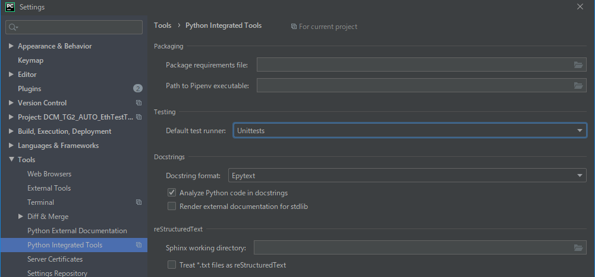
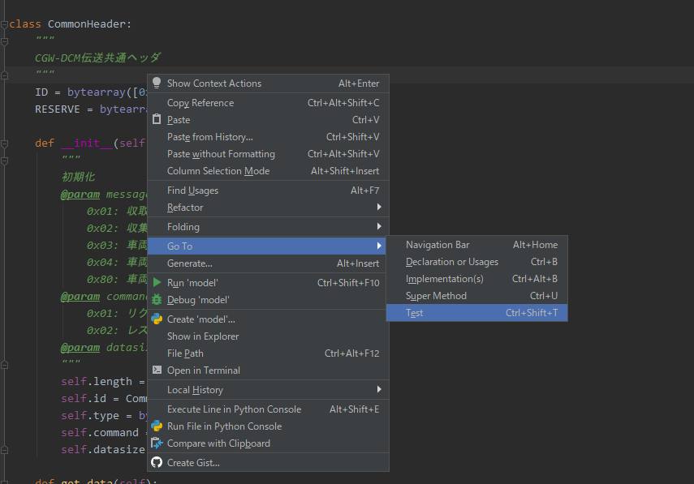
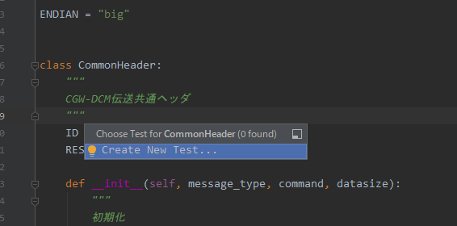
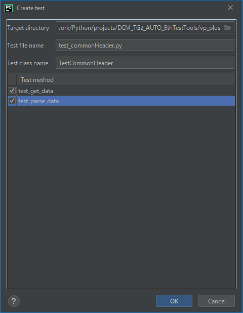
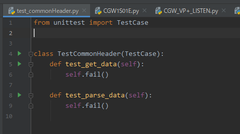
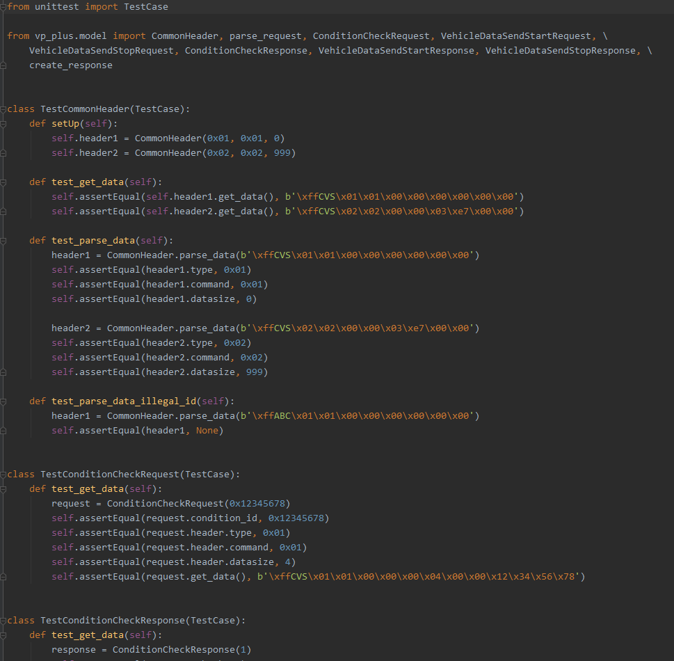

# Test first for Python on PyCharm

## set up for test runner
* テストフレームワークは既定で[unittest](https://docs.python.org/ja/3/library/unittest.html?highlight=unittest#module-unittest)が選択される。
* unittestはPython標準ライブラリに含まれるJunitライクなテストフレームワークです。
* 
## create test
1. テスト対象スクリプト(例：class CommonHeader) のエディタ画面で右クリックし、「Go To/Test」を選択

    
1. 「Create New Test...」を実行

    
1.  テストスクリプト、テストメソッドを設定する。

    
1.  テストスクリプト(test_commonHeader.py)にテストスケルトンが生成される。

    
    
## create test code
* [参考:unittest](https://docs.python.org/ja/3/library/unittest.html?highlight=unittest#organizing-test-code)
* テストコードのポイント
    * PyCharmの「Create New Test...」による自動生成では対象メソッド、対象クラスにつき１テストファイルが生成される。
    * 文末に添付するように、１スクリプトについて１テストファイルに纏めたほうが都合がいい。
    
* 
